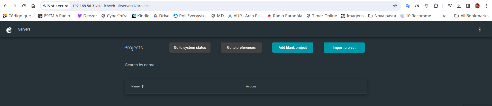

# gns3Aulas
Arquivos e script para configuração da VM do GNS3 para as aulas de Redes de Computadores e Cibersegurança da UTFPR de Campo Mourão.

Esse script configura a VM do GNS3 incluindo/configurando todos os recursos necessários para as aulas de Redes de Computadores e Cibersegurança, o que inclui: Dockers representando hosts cliente e roteador Linux, bem como os roteadores Cisco 7200 e 3640 (sendo que este último é utilizado como switch).

## Instalação

Tudo inicia baixando a VM do GNS3 em <https://www.gns3.com/software/download-vm>. Depois de acessar tal VM via ``SSH -Y``, execute os passos/comandos a seguir:


1. Clone o projeto ou faça o _download_:

```console
$ git clone https://github.com/luizsantos/gns3Aulas
```

2. Entre no diretório do projeto:

```console
$ cd gns3Aulas
```

3. Execute o script:

```console
$ sh install.sh
```

ou

```console
$ ./install.sh
```

4. Após isso responda as perguntas do script, que basicamente são:

* Instalar appliances/templates no GNS3? (responder sim para essa é praticamente obrigatório)

> Os appliances são:
> i. um host Linux para simular clientes de rede no modo texto - é um docker;
> ii. um roteador Linux (com o Quagga); iii. um roteador Cisco 7200;
> iv. um switch Camada 3 Cisco 3640 (estou usando esse como switch, pois o GNS3 tem problemas com switchs Cisco L2, mas ele é também um roteador - não quero usar o qemu);

* (OPCIONAL) Instalar o GNS3-gui, para acessar o GNS3 com uma interface gráfica desktop, via X11/SSH?

> Caso você não faça esse passo o acesso será apenas via interface Web, que é o mais recomendável, pois alguns sistemas dão muito trabalho para acessar o gráfico via SSH.

* (OPCIONAL) Instalar o [i3](https://i3wm.org/) e ambiente gráfico do Linux, isso permitirá executar a interface gráfica do GNS3 dentro da própria VM.

> Caso você faça esse passo, entende-se que você vai utilizar o GNS3 dentro da própria VM e não via interface Web (que é o mais recomendado). Esse passo só faz sentido se você disse sim para o passo anterior (instalar GNS3-gui).

    Alguns comandos do i3 neste ambiente:
    * Alt+Enter - Abrir terminal;
    * Alt+g - Abrir GNS3;
    * Alt+Delete - Fechar janela;
    * Alt+d - procurar e executar algum programa/aplicativo (conforme você for digitando, sugestões de programas serão apresentados no topo da tela);
    * Alt+algum número - Abrir um novo ambiente;
    * Alt+Shift e algum numero - Mover janela para o ambiente;
    * Alt+Shift e setas - Mover Janelas;
    * Alt+r e setas - Alterar tamanho das janelas - depois dê Esc para sair deste modo;
    * Alt+Shift+e - Sair do i3.

# Atenção!
> __Não apagar o diretório do projeto__, depois de terminar a instalação, pois as imagens dos roteadores ficarão dentro deste diretório para economizar espaço na VM.

5. Acesso a VM via interface Web

Após a instalação, deduzindo que você vai utilizar a interface Web para acesso ao GNS (que é o mais recomendável), são necessários os seguintes passos:

*  Obter a URL de acesso na tela da VM. Por exemplo, vamos ver tal tela na Figura 1:
|  |
|:--:|
| Figura 1 - VM em execução no VirtualBox |

No exemplo da Figura 1, a URL a ser acessada é a http://192.168.56.31

> **Atenção**, tal URL pode mudar de instalação para instalação, então você deve verificar o IP que está na sua VM.

* De posse da URL informada na VM, o próximo passo é abrir um navegar na máquina hospedeira (não na VM, mas sim na máquina real). Por exemplo você deve abrir o seu Firefox ou Google Chrome e digital a URL obtida, tal como o exemplo da Figura 2:

|  |
|:--:|
| Figura 2 - Interface Web para criação de projetos no GNS3 |

No exemplo da figura anterior é possível criar um projeto no GNS3, mas também seria possível abrir um já existente (que não é o caso da imagem).
Após isso é só inserir/alterar os elementos de rede no GNS3, tal como ilustra a Figura 3.

|  |
|:--:|
| Figura 3 - Interface Web com um projeto do GNS3 em execução |

E boa diversão... ;-)
